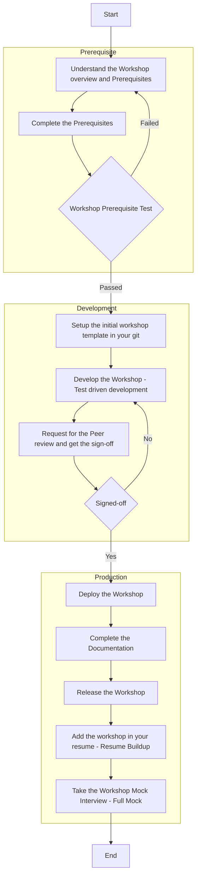

# Recohut Data Bootcamps

Recohut Provides the following bootcamps:

1. Data Engineering
2. Data Science

We follow 2 simple principle for outstanding results:

1. Agile
2. Workshops

##  Workshop Process

## Prerequisites

1. Python & SQL - You should have at least intermediate-level knowledge of Python and SQL.
2. Time - You need to commit at least 4 hours per day for a time span of 8-10 weeks to gain the skills.
